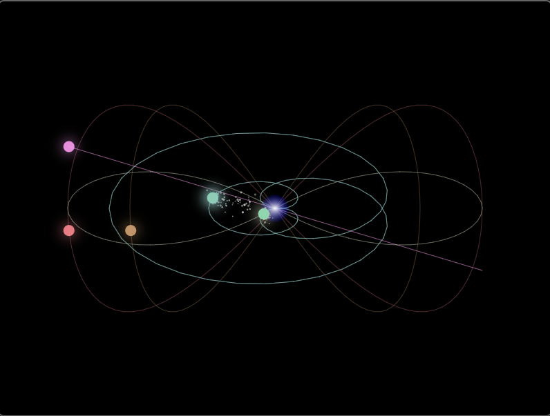

# Cymatic Cosmos ✨🎵⚡

*A voice-reactive polyrhythmic music visualizer that transforms sound into sacred geometry*

   

## 🚀 Try It Now!

**[🌌 Launch Cymatic Cosmos](https://jkh2.github.io/cymatic-cosmos/)**  
*Experience the cosmic symphony in your browser - no installation required!*

*Tesla coil effects and polyrhythmic orbs creating cosmic harmony*

> 💡 **Tip**: Allow microphone access when prompted to experience the full voice-reactive starfield magic!

---

## 🌟 What is Cymatic Cosmos?

Cymatic Cosmos is an interactive web application that combines mathematics, music, and physics to create a living visual symphony. Watch as colorful orbs trace beautiful mathematical paths while stars respond to your voice like particles in a cymatic experiment, creating stunning Tesla coil-like effects and sacred geometric patterns.

### ✨ Key Features

- **🎭 Advanced Polyrhythmic Engine**: 12 customizable tracks with different rhythmic cycles creating evolving musical patterns
- **🌌 Voice-Reactive Starfield**: 200+ stars forming cymatic patterns based on real-time frequency analysis  
- **⚡ Tesla Coil Effects**: Stars create mesmerizing electric spark visuals when orbs pass through them
- **🙏 Sacred Prayer Mode**: Harmonic response system generating complementary musical intervals from your voice
- **🎨 Mathematical Beauty**: Six curve types including figure-8, infinity, spiral, and rose patterns
- **📸 Instant Screenshots**: Capture and save your cosmic creations as high-quality images
- **💾 Preset System**: Save and share your perfect configurations with the community
- **🎵 Crystal Clear Audio**: Professional synthesis with compression, reverb, and smooth envelopes
- **📱 Responsive Design**: Perfectly centered, professional interface that works on all devices

## 🚀 Quick Start

1. **Download** the `cymatic-cosmos.html` file
2. **Open** in any modern web browser  
3. **Click "Play"** to start the polyrhythmic patterns
4. **Click "Enable Mic"** to activate voice interaction
5. **Speak, sing, or hum** to see stars dance in cymatic patterns!
6. **Take Screenshots** to capture your cosmic moments
7. **Save Presets** to preserve your perfect settings

*No installation required - completely self-contained!*

## 🎮 Complete Feature Guide

### 🎛️ **Main Controls**
- **▶ Play/Pause**: Start or stop the musical patterns
- **🎤 Enable Mic**: Activate voice interaction with starfield (requires microphone permission)
- **🙏 Prayer Mode**: Enter sacred experience with harmonic voice response
- **📸 Screenshot**: Capture and download your cosmic creation as PNG
- **💾 Save Preset**: Save current settings as downloadable JSON file + local storage
- **📂 Load Preset**: Load presets from files or recent saves (up to 10 stored locally)
- **Tempo Slider**: 20-200 BPM (try 30 BPM for deep meditation!)
- **Voice Influence**: Control how dramatically your voice affects visuals

### 🎵 **Track System** 
Each of the 12 tracks offers complete customization:
- **🔄 Rhythm**: 2-12 beats per cycle (creates complex polyrhythmic relationships)
- **🌀 Path Type**: Choose from 6 mathematical curves:
  - Figure-8: Classic lemniscate pattern
  - Horizontal: Wide elliptical loops  
  - Vertical: Tall flowing curves
  - Infinity: True mathematical infinity symbol
  - Spiral: Expanding/contracting spirals
  - Rose: Complex rose curve mathematics
- **🎼 Musical Note**: Full chromatic range (C4-C5)
- **🔊 Volume**: Individual track volume control
- **⚡ Active/Inactive**: Toggle tracks on/off for different combinations
- **🎨 Colors**: Dynamic color system (changes in Prayer Mode)

### 🙏 **Sacred Prayer Mode**
Transform your voice into divine harmony:
- **Auto-Tempo**: Slows to meditative 40 BPM
- **Sacred Palette**: Shifts to golds, celestial blues, and warm colors
- **Harmonic Analysis**: Detects your voice's fundamental frequency
- **Interval Generation**: Creates perfect fifths, octaves, and golden ratio harmonies
- **Ethereal Atmosphere**: Enhanced reverb and delay for spiritual experience
- **Visual Transformation**: Background becomes deep cosmic gradient

## 📸 **Capture & Share System**

### 🖼️ **Screenshots**
- **High Quality**: Full 800x600 resolution PNG images
- **Smart Naming**: Automatic timestamping (`cymatic-cosmos-2024-01-15T14-30-45.png`)
- **Instant Download**: One-click capture of your cosmic moment
- **Perfect for**: Social media, presentations, art portfolios, documentation

### 💾 **Preset System**
**Save Presets:**
- Captures ALL settings: tracks, tempo, colors, prayer mode, voice influence
- Downloads as shareable JSON file
- Stores recent presets locally for quick access
- Custom naming with timestamp defaults

**Load Presets:**
- Upload preset files shared by others
- Quick access to your 10 most recent creations  
- Smart menu system with creation dates
- Perfect restoration of all settings

**Community Sharing:**
- Share JSON files with friends, students, or colleagues
- Create preset libraries for different purposes
- Build collections: "Meditation," "Education," "Art Installations"

## 🔬 The Science Behind the Magic

### Cymatic Visualization
The starfield uses real cymatic physics principles:
- **Frequency Analysis**: Your voice is analyzed across 32 frequency bands
- **Wave Interference**: Different frequencies create standing wave patterns
- **Node Formation**: Stars collect at stable points like sand on a vibrating plate
- **Tesla Effect**: Orbs create electromagnetic-like attraction fields

### Polyrhythmic Mathematics
- Each track follows a different rhythmic cycle
- Complex mathematical relationships create natural musical phrases
- Example: 4-beat + 3-beat cycles align every 12 beats
- Longer cycles (like 7 + 11) create evolving, hypnotic patterns

### Audio Engineering
- Built with Tone.js for professional synthesis
- Multi-stage audio processing (compression, limiting, reverb)
- Smooth envelopes prevent audio clicks and pops
- Harmonic generation based on music theory intervals

## 🎨 Visual Modes

### Rest Mode (No Mic Input)
- Stars spread naturally across the screen
- Gentle gravitational drift creates organic movement
- Tesla coil effects when orbs pass through starfield
- Peaceful, meditative atmosphere

### Voice Mode (With Mic Input)
- Stars form cymatic patterns based on your voice frequencies
- Different pitches create different geometric arrangements
- Real-time frequency spectrum analysis
- Sacred geometry emerges from sound

## 🛠️ Technical Details

- **Pure HTML/CSS/JavaScript** - No frameworks required
- **Web Audio API** for real-time audio analysis
- **Tone.js** for professional music synthesis
- **SVG** for smooth, scalable graphics
- **Responsive design** works on desktop and mobile

## 🎯 Perfect For

- 🧘 **Meditation & Prayer**: Voice-responsive sacred geometry with harmonic accompaniment
- 🎵 **Music Education**: Visualize complex polyrhythmic relationships and mathematical beauty  
- 🔬 **Science Demonstrations**: Real cymatic physics principles in interactive format
- 🎨 **Art Creation**: Generate unique cosmic visuals for galleries, installations, presentations
- 📚 **Educational Content**: Screenshot and preset systems perfect for curriculum development
- 🎉 **Interactive Experiences**: Voice-controlled cosmic art for events and workshops
- 🏥 **Therapeutic Applications**: Calming visuals and sounds for meditation therapy
- 💫 **Personal Exploration**: Discover the mathematical relationships in music and sound
- 📱 **Social Sharing**: Create and share beautiful cosmic moments with friends

## 🌟 Browser Compatibility

- ✅ **Chrome/Edge**: Full support
- ✅ **Firefox**: Full support  
- ✅ **Safari**: Full support
- 📱 **Mobile**: Works great on phones/tablets

*Requires microphone access for voice interaction features*

## 🤝 Contributing

This project welcomes contributions! Some exciting possibilities:

**🔬 Science & Mathematics:**
- Additional mathematical curve paths (hypocycloids, epicycloids, Lissajous curves)  
- Enhanced cymatic algorithms with more accurate wave physics
- Advanced harmonic series generation beyond current intervals
- Real-time pitch detection improvements

**🎨 Visual & Audio:**
- New synthesis types and audio effects
- Particle system enhancements (trails, decay effects, color morphing)
- Additional visual modes (3D projections, kaleidoscope effects)
- Advanced screenshot features (different resolutions, formats)

**💻 Technical:**
- Video recording functionality (MP4/GIF export)
- Mobile-specific touch controls and optimizations
- Accessibility improvements (keyboard navigation, screen readers)
- Performance optimizations for older devices
- WebGL acceleration for larger particle counts

**🌐 Community:**
- Preset sharing platform integration
- Social media sharing enhancements  
- Educational curriculum packages
- Multi-language support

## 💡 Preset Ideas to Get Started

Try creating these preset types:
- **"Deep Meditation"**: Slow tempo (25 BPM), prayer mode, tracks 1-4 active
- **"Cosmic Storm"**: Fast tempo (180 BPM), all tracks active, high voice influence
- **"Sacred Geometry"**: Medium tempo (60 BPM), prayer mode, figure-8 and infinity paths
- **"Tesla Laboratory"**: Medium tempo, tracks with different paths for maximum Tesla effects
- **"Mathematics Demo"**: Educational preset showing polyrhythmic relationships clearly
- **"Healing Frequencies"**: Specific notes and rhythms based on sound therapy principles

## 📚 Educational Value

Cymatic Cosmos demonstrates:
- **Physics**: Wave interference, resonance, cymatics
- **Mathematics**: Geometric curves, rhythm relationships
- **Music Theory**: Polyrhythms, harmonic intervals
- **Programming**: Web Audio API, real-time graphics
- **Art**: Generative visuals, interactive design

## 🙏 Acknowledgments

Inspired by:
- Hans Jenny's cymatic research
- Sacred geometry traditions
- Polyrhythmic music from around the world
- Tesla coil physics demonstrations
- The mathematical beauty of the cosmos

## 📄 License

**Creative Commons Attribution-NonCommercial-ShareAlike 4.0 International (CC BY-NC-SA 4.0)**

This work is licensed under a [Creative Commons Attribution-NonCommercial-ShareAlike 4.0 International License](http://creativecommons.org/licenses/by-nc-sa/4.0/).

**You are free to:**
- 🔄 **Share** — copy and redistribute the material in any medium or format
- 🔧 **Adapt** — remix, transform, and build upon the material

**Under the following terms:**
- 👤 **Attribution** — You must give appropriate credit, provide a link to the license, and indicate if changes were made
- 🚫 **NonCommercial** — You may not use the material for commercial purposes
- 🔄 **ShareAlike** — If you remix, transform, or build upon the material, you must distribute your contributions under the same license

**Commercial Licensing:** For commercial use, licensing inquiries, or custom implementations, please contact the project maintainer.

---

*"In the beginning was the Word, and the Word was made flesh through frequency, resonance, and sacred geometry."*

**Experience the cosmos responding to your voice. Speak, and watch the universe dance.**
