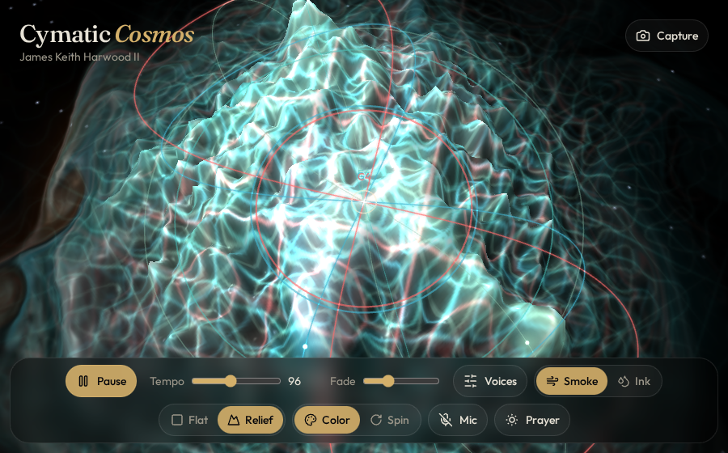

# Cymatic Cosmos ✨🎵🌫️

*A polyrhythmic instrument that writes its music into living smoke*

    

## 🚀 Try It Now!

**[🌌 Launch Cymatic Cosmos](https://jkh2.github.io/cymatic-cosmos/)**
*Opens in your browser, no installation required. Press Play, then drag anywhere to stir the smoke.*

*Twelve polyrhythmic voices trail colored smoke through a live fluid simulation. Each note presses its Chladni figure into the smoke as its orb crosses the center.*

*Relief view: the smoke rises into glowing terrain, and the Chladni figures stand up as ridges you can orbit and fly over.*

> 💡 **Tip:** Turn on **Mic** and sing. Your voice blows smoke out from the center, and your pitch chooses its color.

---

## 🌟 What is Cymatic Cosmos?

Cymatic Cosmos joins music, mathematics and fluid physics into one instrument. Twelve voices travel six sacred curves in polyrhythm. Each voice sounds as its orb crosses the center, and each note is *drawn* as well as heard: the Chladni pattern for that pitch is pressed into a real-time smoke simulation, then carried off by the current. Your hands and your voice move the same smoke.

### ✨ Features

- **🌫️ Living smoke**: a GPU Navier-Stokes fluid on a black field, with a gentle current that quickens with the tempo
- **🎭 Twelve-voice polyrhythm**: each voice has its own rhythmic cycle, curve and note, and all share one downbeat
- **☄️ Orbs paint the smoke**: every voice trails a comet of its own color along its curve
- **〰️ Cymatic notes**: each note imprints the Chladni figure for its pitch, glowing at the heart and fading into darkness at the edges
- **⛰️ Relief view**: the smoke becomes luminous terrain you can zoom, orbit and fly over
- **✋ Stir it yourself**: drag anywhere to stir, with a brush about two inches wide
- **🎤 Voice control**: loudness sets how hard the smoke jets blow, the tone of your voice picks which jets fire, and your pitch sets the color
- **🙏 Prayer mode**: a slower tempo and a sacred palette, and a held sung note is answered with root, fifth and octave
- **🎨 Smoke or Ink**: rising smoke that clears quickly, or ink in still water that lingers and curls
- **📸 Capture and presets**: save a picture, and save or share your settings

## 🎮 How to Play

1. **Press Play.** The orbs start moving, and each one sounds as it crosses the center.
2. **Drag anywhere** to stir the smoke.
3. **Switch to Relief** (or just scroll) to lift the smoke into terrain, then fly around it.
4. **Turn on Mic** and speak, sing or hum. It works even while the music is paused.
5. **Open Voices** to change each voice's rhythm, curve and note, or to turn on all twelve.

### 🎛️ Controls

| Control | What it does |
|---|---|
| **Play / Pause** | Starts and stops the orbs and the music (keyboard: Space) |
| **Tempo** | 20–200 BPM. Also sets how fast the smoke current flows |
| **Fade** | How quickly the smoke clears. Left lingers, right clears fast |
| **Voices** | The twelve-voice panel: rhythm, curve, note, voice influence, presets (Esc closes it) |
| **Smoke / Ink** | How the fluid behaves. Smoke rises and clears; ink lingers and curls |
| **Flat / Relief** | Look straight down, or lift the smoke into 3D terrain |
| **Color / Spin** | See the smoke itself, or a map of how the fluid is turning (amber counterclockwise, teal clockwise) |
| **Mic** | Your voice moves the smoke. The ring around the icon swells as it hears you |
| **Prayer** | Slow tempo, sacred palette, and harmony that answers your voice |
| **Capture** | Saves a PNG of the current moment |

### ⛰️ Moving around in Relief view

| On a computer | On a phone or tablet | Does |
|---|---|---|
| Scroll wheel | Pinch | Zoom in and out |
| Right-drag, or Shift + drag | Two-finger drag | Orbit and tilt |
| Left-drag | One-finger drag | Stir the smoke where you point |
| Double-click | | Return to the starting view |

While the music plays, the view drifts slowly around the scene on its own. It stops when you take the camera and resumes after a few quiet seconds.

### 🎵 The Twelve Voices

Each voice can be tuned in the **Voices** panel:
- **Rhythm**: 2 to 16 beats per cycle. Different cycles drift apart and meet again, like 3 against 4 lining up every 12 beats.
- **Curve**: Figure-8, Horizontal, Vertical, Infinity, Spiral or Rose. All six pass through the center.
- **Note**: G3 to F5.
- **Quartet / All**: four voices (C4, E4, G4, B4) by default, or all twelve at once.

**Presets** save everything (voices, tempo, voice influence, Prayer mode) as a JSON file you can share. Your ten most recent are kept in your browser.

## 🔬 The Science Behind It

### Chladni figures
In 1787 Ernst Chladni scattered sand on a metal plate and drew a violin bow across its edge. The sand gathered along the lines that stay still, and every tone made its own figure. Cymatic Cosmos gives each of the twelve pitch classes its own plate mode, and higher octaves add more rings, so every note has a figure of its own. When an orb crosses the center, that figure is pressed into the smoke.

### Fluid dynamics
The smoke is a real-time solution of the incompressible Navier-Stokes equations on the GPU, using Jos Stam's *stable fluids* method: advection, vorticity confinement to keep the swirls alive, and a pressure solve that keeps the flow incompressible. The background current comes from a slowly turning stream function, so it never fights the physics. The same approach powers the companion [Navier-Stokes Laboratory](https://github.com/jkh2/navier-stokes-laboratory).

### Polyrhythm
All twelve voices share one beat clock, and each completes its curve in its own number of beats. A 4-beat and a 3-beat voice meet every 12 beats. Longer cycles like 7 and 11 take 77 beats to realign, which makes phrases that keep evolving.

### Your voice
The microphone signal is measured three ways: loudness in decibels, energy in ten bands from 90 Hz to 4 kHz, and pitch by autocorrelation. Loudness drives the strength of a ring of smoke jets, the bands choose which jets fire, and the pitch picks the color and the Chladni figure at the center.

## 🎯 Perfect For

- 🧘 **Meditation and prayer**: slow tempo, Prayer mode and Relief view with the drifting camera
- 🎵 **Music education**: see polyrhythm, and see that every pitch has its own shape
- 🔬 **Science demonstrations**: live fluid dynamics and cymatics in one screen
- 🎨 **Art and installations**: full-screen, self-running, voice-reactive visuals
- 🎤 **Singing and voice work**: watch your pitch and breath shape the smoke

## 🌐 Browser Support

Needs a browser with **WebGL2** and float render targets: current Chrome, Edge, Firefox and Safari on desktop, and most modern phones and tablets. The microphone needs permission and a secure (https) page, which GitHub Pages provides. Relief view asks more of the graphics card than Flat view; if it stutters on an older phone, switch back to Flat.

## 🛠️ For Developers

The live page is a single self-contained `index.html`, compiled from the source on the [`rebuild/claude-smoke`](https://github.com/jkh2/cymatic-cosmos/tree/rebuild/claude-smoke) branch.

- **Stack**: React 19, Tailwind 4, Zustand, Tone.js, and a hand-written WebGL2 fluid solver
- **Run locally**: `npm install`, then `npm run dev`
- **Build the single file**: `npm run build:standalone` writes `dist-standalone/index.html`; copy it to the root of `main` to publish
- **Test on slow renderers**: add `?simdt` to the URL to step at a true 1/60 s per frame

Key files: `src/lib/fluid/` (solver and shaders), `src/components/cosmos/stage.tsx` (the instrument, overlay and camera), `src/lib/cosmos/audio.ts` (synth, mic and pitch), `src/lib/cosmos/camera.ts` (Relief camera).

## 🕰️ The Classic Edition

**[Open the classic version](https://jkh2.github.io/cymatic-cosmos/classic/)**. The original 2D instrument is preserved unchanged: an SVG starfield of 200 stars that gather into cymatic patterns with your voice, and Tesla-coil sparks as orbs pass through.

*The classic edition: Tesla coil effects and polyrhythmic orbs creating cosmic harmony*

## 🙏 Acknowledgments

Created by **James Keith Harwood II**. The smoke edition was built in collaboration with AI partners Grok (xAI) and Claude (Anthropic).

Inspired by:
- Ernst Chladni's sound figures and Hans Jenny's cymatic research
- Jos Stam's *Stable Fluids*
- Sacred geometry traditions
- Polyrhythmic music from around the world
- The mathematical beauty of the cosmos

## 📄 License

**Creative Commons Attribution-NonCommercial-ShareAlike 4.0 International (CC BY-NC-SA 4.0)**

This work is licensed under a [Creative Commons Attribution-NonCommercial-ShareAlike 4.0 International License](http://creativecommons.org/licenses/by-nc-sa/4.0/).

**You are free to:**
- 🔄 **Share**: copy and redistribute the material in any medium or format
- 🔧 **Adapt**: remix, transform, and build upon the material

**Under the following terms:**
- 👤 **Attribution**: you must give appropriate credit, provide a link to the license, and indicate if changes were made
- 🚫 **NonCommercial**: you may not use the material for commercial purposes
- 🔄 **ShareAlike**: if you remix, transform, or build upon the material, you must distribute your contributions under the same license

**Commercial Licensing:** For commercial use, licensing inquiries, or custom implementations, please contact the project maintainer.

Third-party libraries keep their own licenses (Tone.js, React and others are MIT licensed).

---

*"In the beginning was the Word, and the Word was made flesh through frequency, resonance, and sacred geometry."*

**Press Play, and watch the music write itself into the smoke.**
